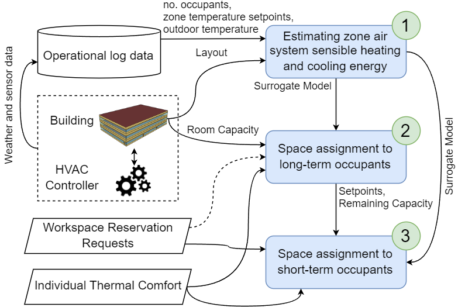

# Comfort-aware Optimal Space Planning in Shared Workspaces
This repository contains the codebase for [Comfort-aware Optimal Space Planning in Shared Workspaces](https://github.com/sustainable-computing/COBS-space-planning). The bibliographic citation will be added here later.

## Description
We explore the joint optimization of space use and heating and cooling demand in a coworking space that offers long-term and daily plans. 
An input convex neural network is trained to estimate the energy consumed
by the HVAC system in a single day to condition a given zone of the building.
Due to the convexity of this model in its inputs,
it is possible to formulate a convex mixed-integer program to optimize HVAC energy consumption
by deciding how to assign desks to occupants and adjust zone temperature setpoints.
Considering a medium-sized office building as the coworking space,
we show that this optimization problem can be solved to near-optimality relatively quickly,
hence it can be used to make decisions regarding long-term bookings. 
For daily bookings, we design heuristic algorithms that take the solution of the optimization problem
and assign the remaining space, while ensuring the satisfaction of thermal comfort constraints.
By incorporating these algorithms in the workspace reservation system,
we quantify the potential savings that can be achieved.



This repository is licensed under [MIT](https://github.com/sustainable-computing/COBS-space-planning/blob/main/LICENSE). 
Code is written by [Tianyu Zhang](https://tianyuzhang.com/).

## Contributing
We welcome contributions to this work in different forms, such as bug reports, pull requests, etc.

## Prerequisites
Make sure to have [EnergyPlus](https://energyplus.net/) 9.3.0 installed on your computer. This code is not compatible with other version of EnergyPlus. The [COBS](https://github.com/sustainable-computing/COBS) simulator is included in the repository for completeness.

## Dependencies

| Packages               | Version |
|------------------------|:-------:| 
| tqdm                   | 4.65.0  |
| numpy                  | 1.25.1  |
| scikit-learn           |  1.3.0  |
| torch                  |  2.0.1  |
| eppy                   | 0.5.53  |
| gurobipy               | 10.0.2  |
| gurobi-machinelearning |  1.3.2  |
| pandas                 |  2.0.3  |

## Usage
Bash script `run_experiments.sh` can be used to run all experiments and reproduce the results in the paper. Make sure to run it one step at a time, wait for the execution to finish, and then run the next step. You can comment out the steps that you do not plan to execute.

All plots can be reproduced using `plot_result.ipynb`. We have included the necessary CSV result file and pickle dumps to draw all plots in this repository.


### Step-by-Step Instructions
Execute `building_simulation.py` to generate offline training data.
```
python3 building_simulation.py
```
Then, run `longterm_optimization.py` to find the optimal assignment for long-term occupants.
```
longterm_optimization.py [-h] [--estimator {linear,rf,nn}] [--warm_start WARM_START] [--num_long_term NUM_LONG_TERM]
                              [--seed SEED] [--thermal_threshold THERMAL_THRESHOLD] [--min_group_size MIN_GROUP_SIZE]
                              [--max_group_size MAX_GROUP_SIZE] [--min_temp_set MIN_TEMP_SET] [--max_temp_set MAX_TEMP_SET]
                              [--gap_tolerance GAP_TOLERANCE] [--special {none,uniform_number,uniform_ratio,random}]
                              [--with_zone_temp WITH_ZONE_TEMP] [--nn_shape NN_SHAPE] [--save_result SAVE_RESULT]

options:
  -h, --help            show this help message and exit
  --estimator {linear,rf,nn}
                        Define what estimator should be used for Q_zone estimation, possible choices: linear, rf, nn
  --warm_start WARM_START
                        Define whether to use greedy approach for warm starting solver
  --num_long_term NUM_LONG_TERM
                        Define how many long term occupants are in the building
  --seed SEED           Define random seed to use
  --thermal_threshold THERMAL_THRESHOLD
                        Define hard constraint on thermal comfort score
  --min_group_size MIN_GROUP_SIZE
                        Define minimum number of occupants in the group
  --max_group_size MAX_GROUP_SIZE
                        Define maximum number of occupants in the group
  --min_temp_set MIN_TEMP_SET
                        Define minimum thermostat setpoint
  --max_temp_set MAX_TEMP_SET
                        Define maximum thermostat setpoint
  --gap_tolerance GAP_TOLERANCE
                        Define Dual and Primal bound gap tolerance
  --special {none,uniform_number,uniform_ratio,random}
                        Run assignment with special rule, choices: none, uniform_number, uniform_ratio, random
  --with_zone_temp WITH_ZONE_TEMP
                        Estimate Q with adjacent zone temperature or not
  --nn_shape NN_SHAPE   For NN estimator, give a python list style layer design
  --save_result SAVE_RESULT
                        Overwrite the result dump or not
```
An example command would be:
```
python3 longterm_optimization.py --seed 2023 --estimator rf
```

Finally, run `full_experiment.py` as follows
```
full_experiment.py [-h] [--online {bestfit_energy,bestfit_space,online_minlp,uniform_number,uniform_ratio,random,none}]
                        [--num_visitor NUM_VISITOR] [--seed SEED] [--days DAYS] [--energy ENERGY] [--reprocess REPROCESS]
                        [--parallel PARALLEL] [--n N] [--job_name JOB_NAME] [--min_group_size MIN_GROUP_SIZE]
                        [--max_group_size MAX_GROUP_SIZE] [--min_temp_set MIN_TEMP_SET] [--max_temp_set MAX_TEMP_SET]
                        [--thermal_threshold THERMAL_THRESHOLD] [--designate_base DESIGNATE_BASE] [--curves CURVES]
                        [--debug DEBUG]

options:
  -h, --help            show this help message and exit
  --online {bestfit_energy,bestfit_space,online_minlp,uniform_number,uniform_ratio,random,none}
                        Define what online algorithm should be used.
  --num_visitor NUM_VISITOR
                        Define in average how many visitors are in the building per day
  --seed SEED           Define random seed to use
  --days DAYS           Define days to simulate
  --energy ENERGY       Define whether simulate the energy consumption
  --reprocess REPROCESS
                        Define whether redo simulation for finished jobs
  --parallel PARALLEL   Define run on how many threads
  --n N                 Define current thread id
  --job_name JOB_NAME   Define a name
  --min_group_size MIN_GROUP_SIZE
                        Define minimum number of occupants in the group
  --max_group_size MAX_GROUP_SIZE
                        Define maximum number of occupants in the group
  --min_temp_set MIN_TEMP_SET
                        Define minimum thermostat setpoint
  --max_temp_set MAX_TEMP_SET
                        Define maximum thermostat setpoint
  --thermal_threshold THERMAL_THRESHOLD
                        Define hard constraint on thermal comfort score
  --designate_base DESIGNATE_BASE
                        Define offline MINLP solution file
  --curves CURVES       Log the evaluation changing trend
  --debug DEBUG         Use specific node to debug
```

An example command would be:
```
python3 full_experiment.py --curves False --energy True --reprocess True --online bestfit_energy --num_visitor 100 --seed 2023 --debug True
```
